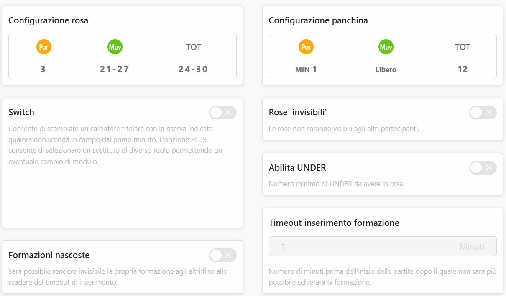
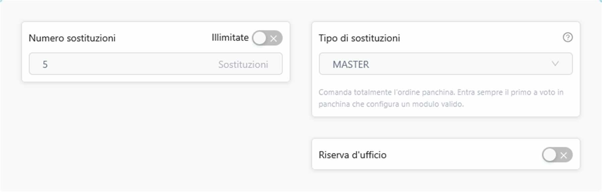
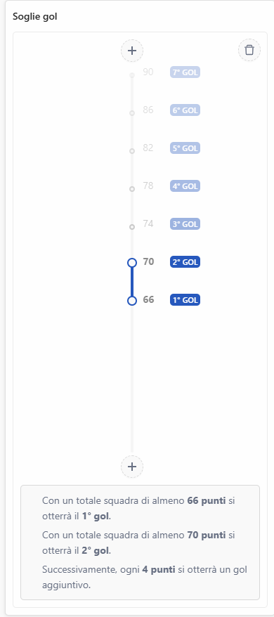
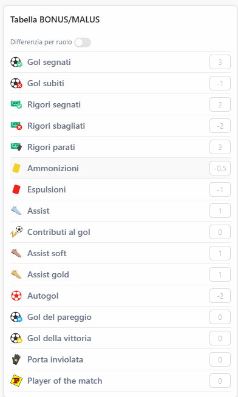

# Regolamento Fantacalcio

**Rev05 — 02/09/2025**

## 1. Formula a girone doppio

L'adozione di questo sistema prevede due gironi da otto squadre (Serie A e Serie B).

### Suddivisione anno zero

I due gironi di Serie A e Serie B dell'anno ZERO saranno così composti:

**SERIE A**

| # | Squadra |
|---|---------|
| 1 | Anto & Impe |
| 2 | Pobbi & Tia |
| 3 | Tommy |
| 4 | Charlie |
| 5 | Ste Mora, Fefe & Ale Lissi |
| 6 | Mino & Giolla |
| 7 | Vinci |
| 8 | Carlo |

**SERIE B**

| # | Squadra |
|---|---------|
| 1 | Nico |
| 2 | Cri |
| 3 | Gio |
| 4 | Trilly |
| 5 | Bruno |
| 6 | Zecca |
| 7 | Rouge |
| 8 | Manu |

### Premi, promozione/retrocessione

La quota di iscrizione è di 70 €/squadra per la Serie A e 50 €/squadra per la Serie B.

**SERIE A**

| Classifica | Premio |
|------------|--------|
| 1° classificato | 325€ |
| 2° classificato | 140€ |
| 3° classificato | 70€ |
| 4° classificato | - |
| 5° classificato | - |
| 6° classificato | Retrocessione |
| 7° classificato | Retrocessione |
| 8° classificato | Retrocessione |

**SERIE B**

| Classifica | Premio |
|------------|--------|
| 1° classificato | 225 € + 20 € / Prom. |
| 2° classificato | 100 € / Prom. |
| 3° classificato | 50 € / Prom. |
| 4° classificato | - |
| 5° classificato | - |
| 6° classificato | - |
| 7° classificato | - |
| 8° classificato | -20€ |

### Coppa

Il vincitore della coppa prende 50€ + eventuali multe (vedi [Regolamento formazioni non schierate](#3-regolamento-formazioni-non-schierate)).

La calendarizzazione della coppa verrà effettuata in fase di creazione dei gironi.

La coppa prevede partite tra tutte le squadre indipendentemente dall'appartenenza alla Serie A o Serie B.

## 2. Regolamento Fantacalcio Mantra

### Impostazioni Lega

### Rinvii partite

- **Partite rinviate < 3.** Regola standard della lega: se le partite rinviate vengono recuperate oltre l'inizio del turno successivo si procederà ad assegnare 6 politico.

  

- **Partite rinviate ≥ 3.** Si aspetterà che vengano regolarmente disputate "congelando" i voti fino al recupero delle partite stesse e calcolando al termine dell'ultimo recupero.

## 3. Regolamento formazioni non schierate

Il regolamento prevede per la definizione della regola 2 fattori + 1 condizione:

- **Fattore soglia.** Percentuale di "soglia" sulle formazioni non schierate → 20%
- **Fattore multa.** Multa per ogni formazione non schierata → 5 €.
- **Condizione anno +1.** Il versamento della multa è prerogativa dell'iscrizione al fantacalcio dell'anno successivo.

La soglia lavora come inibitore della penale → se e solo se viene superata la soglia si applicano le penali.

La multa verrà raccolta entro l'asta anno successivo → se non corrisposta impedirà l'iscrizione della squadra al campionato.

## 4. Metodo Osnaghi per l'asta di riparazione

Il metodo è stato introdotto per risolvere tre problemi del metodo di vendita al valore di quotazione:

1. Prendere tanti giocatori a 1 consentiva di fare plusvalenze regolari ma poco sensate per finanziare l'asta di gennaio;
2. Il nostro sistema penalizzava chi compra giocatori pagandoli tanto che poi subiscono infortuni gravi o vengono venduti all'estero perché la loro quotazione a febbraio quando li vendiamo è inevitabilmente crollata;
3. Il nostro sistema disincentivava la liberazione di giocatori forti a gennaio perché avrebbe sempre comportato una perdita ingente di crediti rendendo così meno interessante l'asta di gennaio.

Il Metodo Osnaghi consiste nel liberare il giocatore a gennaio recuperando un numero di crediti calcolato applicando al valore di acquisto la medesima variazione percentuale che intercorre tra la Quotazione Iniziale Mantra e la Quotazione Attuale Mantra al momento della chiusura del mercato di riparazione della Serie A. Se il calcolo restituisce un numero con la virgola esso viene arrotondato all'intero superiore (se il calcolo dà 2,7 il valore sarà 3, se il risultato è 8,1 sarà 9) per favorire l'immissione in circolazione di crediti per finanziare l'asta ed evitare casistiche in cui il calcolo possa restituire il valore 0.

**Esempi esplicativi della norma:**

1. Lautaro viene acquistato per 120 crediti a settembre quando sul sito ha una Quotazione Iniziale Mantra di 40; purtroppo a ottobre incorre in un grave infortunio e la sua Quotazione Mantra Attuale risulta dimezzata a 20 il giorno 01/02 di chiusura del mercato di riparazione della Serie A. Liberandolo si riceverà il prezzo a cui è stato acquistato ma dimezzato, quindi 60.
2. Romano Floriani Mussolini viene pagato 1 a settembre quando sul sito ha Quotazione Iniziale Mantra pari a 3: le sue prestazioni nella prima parte di stagione sono ottime e alla chiusura del mercato di riparazione della Serie A la sua Quotazione Attuale Mantra è salita a 30, decuplicando. Liberandolo si guadagnerà esattamente dieci volte il prezzo a cui lo avete pagato a settembre, quindi 10 crediti.

Nella giornata successiva alla chiusura del mercato di riparazione verrà effettuato il calcolo delle quotazioni secondo il Metodo Osnaghi e inviato a tutti i partecipanti.

## 5. Albo risultati

### Palmarès

| Nome | Totale | Lega unica | A | B | Coppa |
|------|:---:|:---:|:---:|:---:|:---:|
| Pobbi | 4 | 2 | 1 |  | 1 |
| Carlo | 3 | 3 |  |  |  |
| Giolla | 3 | 2 | 1 |  |  |
| Mino | 3 | 2 | 1 |  |  |
| Zecca | 3 | 1 |  | 1 | 1 |
| Nico | 2 | 2 |  |  |  |
| Tommy | 2 | 2 |  |  |  |
| Vinci | 2 | 2 |  |  |  |
| Charlie | 2 | 1 | 1 |  |  |
| Gio | 2 | 1 |  | 1 |  |
| Tia | 2 |  | 1 |  | 1 |
| Fefe | 1 | 1 |  |  |  |
| Impe | 1 | 1 |  |  |  |
| Mary | 1 | 1 |  |  |  |
| Ste Mora | 1 | 1 |  |  |  |
| Toto | 1 | 1 |  |  |  |
| Bruno | 1 |  |  | 1 |  |
| Cri | 1 |  |  |  | 1 |
| Ale Lissi |  |  |  |  |  |
| Anto |  |  |  |  |  |
| Confa |  |  |  |  |  |
| Gigia |  |  |  |  |  |
| Manu |  |  |  |  |  |
| Rey |  |  |  |  |  |
| Rouge |  |  |  |  |  |
| Teo Colo |  |  |  |  |  |
| Teo Lanti |  |  |  |  |  |
| Trilly |  |  |  |  |  |

### 2025-2026 — 17° anno

**Serie A**

| Posto | Squadra |
|-------|---------|
| 1° | Charlie |
| 2° | Mino, Giolla |
| 3° | Pobbi, Tia |
| 4° | Manu |
| 5° | Trilly |
| 6° | Bruno ↓ |
| 7° | Zecca ↓ |
| 8° | Anto, Impe ↓ |

**Serie B**

| Posto | Squadra |
|-------|---------|
| 1° | Gio ↑ |
| 2° | Tommy ↑ |
| 3° | Ste Mora, Teo Lanti ↑ |
| 4° | Vinci |
| 5° | Nico |
| 6° | Rouge |
| 7° | Carlo |
| 8° | Cri |

**Champions league:** Cri 🏆

### 2024-2025 — 16° anno

**Serie A**

| Posto | Squadra |
|-------|---------|
| 1° | Pobbi, Tia |
| 2° | Charlie |
| 3° | Mino, Giolla |
| 4° | Trilly |
| 5° | Zecca |
| 6° | Vinci ↓ |
| 7° | Gio ↓ |
| 8° | Tommy ↓ |

**Serie B**

| Posto | Squadra |
|-------|---------|
| 1° | Bruno ↑ |
| 2° | Anto, Impe ↑ |
| 3° | Manu ↑ |
| 4° | Cri |
| 5° | Rouge |
| 6° | Nico |
| 7° | Carlo |
| 8° | Ste Mora |

**Champions league:** Pobbi, Tia 🏆

### 2023-2024 — 15° anno

**Serie A**

| Posto | Squadra |
|-------|---------|
| 1° | Mino, Giolla |
| 2° | Tommy |
| 3° | Charlie |
| 4° | Vinci |
| 5° | Pobbi, Tia |
| 6° | Carlo ↓ |
| 7° | Ste Mora, Ale Lissi ↓ |
| 8° | Anto, Impe ↓ |

**Serie B**

| Posto | Squadra |
|-------|---------|
| 1° | Zecca ↑ |
| 2° | Trilly ↑ |
| 3° | Gio ↑ |
| 4° | Cri |
| 5° | Rouge |
| 6° | Manu |
| 7° | Bruno |
| 8° | Nico |

**Champions league:** ?? 🏆

### 2022-2023 — 14° anno

| Posto | Squadra |
|-------|---------|
| 1° | Impe, Toto |
| 2° | Ste Mora, Fefe |
| 3° | Carlo |

### 2021-2022 — 13° anno

| Posto | Squadra |
|-------|---------|
| 1° | Mino, Giolla |
| 2° | |
| 3° | Manu, Trilly |

### 2020-2021 — 12° anno

| Posto | Squadra |
|-------|---------|
| 1° | Vinci |
| 2° | Impe, Toto |
| 3° | Pobbi, Tommy, Tia |

### 2019-2020 — 11° anno

| Posto | Squadra |
|-------|---------|
| 1° | Ste Mora, Fefe |
| 2° | Tommy, Tia, Pobbi |
| 3° | Mino, Giolla |

### 2018-2019 — 10° anno

| Posto | Squadra |
|-------|---------|
| 1° | Pobbi, Tommy |
| 2° | Mino, Giolla |
| 3° | Carlo |

### 2017-2018 — 9° anno

| Posto | Squadra |
|-------|---------|
| 1° | Carlo |
| 2° | Vinci |
| 3° | Mino, Giolla |

### 2016-2017 — 8° anno

| Posto | Squadra |
|-------|---------|
| 1° | Charlie |
| 2° | Gio, Rouge, Bruno |
| 3° | Tommy, Pobbi |

### 2015-2016 — 7° anno

| Posto | Squadra |
|-------|---------|
| 1° | Tommy, Pobbi |
| 2° | Nico, Vinci, Mary |
| 3° | Giolla, Mino |

### 2014-2015 — 6° anno

| Posto | Squadra |
|-------|---------|
| 1° | Zecca |
| 2° | Nico, Vinci, Mary |
| 3° | Carlo |

**Coppa lega unica:** Zecca 🏆

### 2013-2014 — 5° anno

| Posto | Squadra |
|-------|---------|
| 1° | Nico, Vinci, Mary |
| 2° | Teo Colo, Cri |
| 3° | Carlo |

### 2012-2013 — 4° anno

| Posto | Squadra |
|-------|---------|
| 1° | Giolla, Mino |
| 2° | Carlo |
| 3° | Nico, Vinci, Mary |

### 2011-2012 — 3° anno

| Posto | Squadra |
|-------|---------|
| 1° | Carlo |
| 2° | |
| 3° | |

### 2010-2011 — 2° anno

| Posto | Squadra |
|-------|---------|
| 1° | Carlo |
| 2° | Rey, Gigia, Mary |
| 3° | Nico, Vinci |

### 2009-2010 — 1° anno

| Posto | Squadra |
|-------|---------|
| 1° | Nico, Gio |
| 2° | Carlo, Cri |
| 3° | Confa, Teo Colo |

## Storico revisioni

| Rev | Data | Descrizione |
|-----|------|-------------|
| Rev00 | 08/06/2023 | Prima emissione regolamento |
| Rev01 | 04/07/2023 | Adozione Serie A e Serie B già dall'anno zero. Eliminata suddivisione casuale dei gironi nell'anno zero. Modificata quota iscrizione Serie A (50€→70€). Modificati i premi assegnati al girone di Serie A (in toto) e Serie B (relativamente alla penale dell'ultimo posto). |
| Rev02 | 07/10/2024 | Aggiunta la regola su rinvio giornate al regolamento. Aggiornato albo risultati. |
| Rev03 | 29/11/2024 | Aggiunta regola formazioni non schierate |
| Rev04 | 31/07/2025 | Fantacalcio Mantra – Nuovo Regolamento e impostazioni |
| Rev05 | 02/09/2025 | Cambiamenti a seguito delle votazioni in data 29/08: Crediti Iniziali da 300 a 500; Malus Rigore Sbagliato da -3 a -2; Bonus Rigore Segnato da +3 a +2; Introduzione Metodo Osnaghi per calcolo valore dei giocatori per l'asta di riparazione; Soglie Gol da 4 invece che da 5. |
